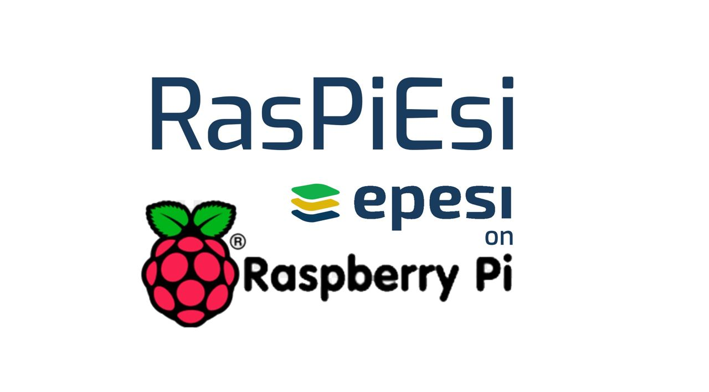
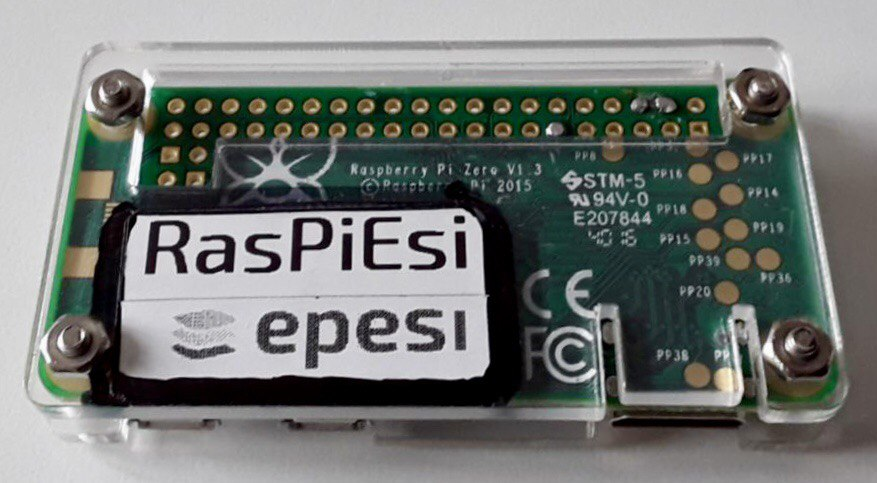
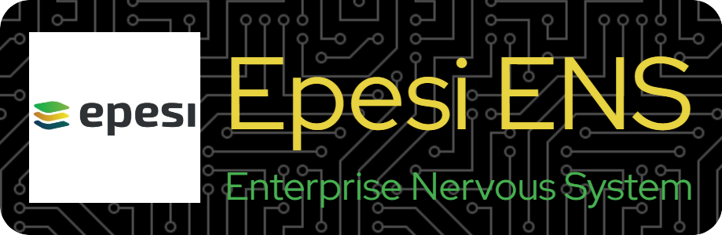

## RasPiEsi = GPIO enabled Epesi on Raspberry Pi

By running Epesi on Raspberry Pi or compatible SBC you can programatically access GPIO port using:
### https://github.com/ronanguilloux/php-gpio
### https://github.com/ronanguilloux/php-gpio-web

### For building real life robotics and other similar solutions where interaction with the real world via GPIO enabled web application is required.
Especially for Small Businesses and Startup Enterprises watching their budget and/or power usage of their infrastructure.

Example: https://github.com/jtylek/EpesiWarehouse, which is a supply chain management solution in addition to WHS (Warehouse Management System) connected
with https://hackaday.com/2022/09/20/its-pi-all-the-way-down-with-this-pi-powered-pi-picking-robot/

**Click the image to watch the video.**

> **RasPiEsi** is The World's Smallest Open Source ERP Application Server powered by **Epesi** and running on $5 USD **Raspberry Pi Zero**.

**RasPiEsi** is the smallest possible **Epesi Node** I was able to build with the smallest RAM usage of only 133MB!
Thanks to the excellent **DietPi** distro this tiny server runs Epesi surprisingly well especially on a fast SD card.
It should run unmodified on any Raspberry Pi - from the lowest end **$5 RPi Zero with no WiFi and 1 CPU and 512 MB of RAM** (used to create this disk image), to the high end RPi 4. Tested fine on RPi 3 - unmodified, just swapped between units!

> **RasPiEsi** is an integral part of **Epesi ENS = Epesi Enterprise Nervous System**

See https://github.com/jtylek/OSENS for Open Source Enterprise Nervous System
Manifesto and sign it if you like the idea. Thank you in advance!

For WiFi models run DietPi configuration utility.

> Default logins:
> - SSH: u:root p:Epe$i123
> - Epesi: u:epesi p:epesi123
> - MariaDB admin: u: p:

To run just download the image and write to SD card using Balena Etcher (Linux, Windows, OS X versions available) and boot the Raspberry Pi Zero connected to the network via USB Ethernet adapter and with a monitor attached to see the IP address (DHCP and no WiFi is the default mode). Alternatively you can find out assigned IP address from the router's DHCP leases list.

### Open browser and point to **http://RasberryPi.Epesi.IP.Address**
Login into Epesi as: "epesi" with password "epesi123"
Follow instructions from notes on your Epesi DashBoard.

Enjoy!

## WARNING!
### Not for production use!
For experiments only. For production Epesi, MariaDB, root, user and all possible passwords including entries in /data/config.php would have to be changed from the default. They were created to jump start the project. In addition to all password changes some additional steps to harden Linux kernel and configure SSH deamon and firewall are needed, which are beyond the scope of this project at this time. An appopriate guide may be added later.

P.S. Please open an issue if you found a bug and document well steps how to reproduce that error.
Don't open issues for new features requests - for this contact me directly via e-mail **j[at]epe.si**
E-mail me also if the image worked for you on a Raspberry Pi model not shown below and I will update the list for other users trying to determine compatibility. You can also open an issue to report your setup especially if you need to document some fixes or tweaks.

Feel free to fork it, customize, distribute. Build cool stuff with it. Like Epesi RAIN - a cluster of Redundant Array od Inexpensive Nodes build with RasPiEsi nodes.

## Free and Open Source ERP Application Server
RPi Zero has only 1 CPU and 512MB of RAM
- Epesi CRM on LLMP stack:
- Linux 
- Lighttpd
- MariaDB - tuned
- PHP 7.4 FPM
- memcached
- ZRAM

This image can be freely downloaded and modified.
Tested on RPi Zero and RPi 3

Credits:

## https://dietpi.com/

plus of course LAMP stack and a lot of Free and Open Source Software.

## IDEA

Create **Epesi RAIN = Redundant Array od Inexpensive Nodes of Epesi**
like this Raspberry Pi Highly Available cluster:

https://github.com/geerlingguy/pi-cluster

https://www.pidramble.com/

Thank you FOSS Developers!

## MIT License
Copyright (c) 2023 by Janusz Tylek
